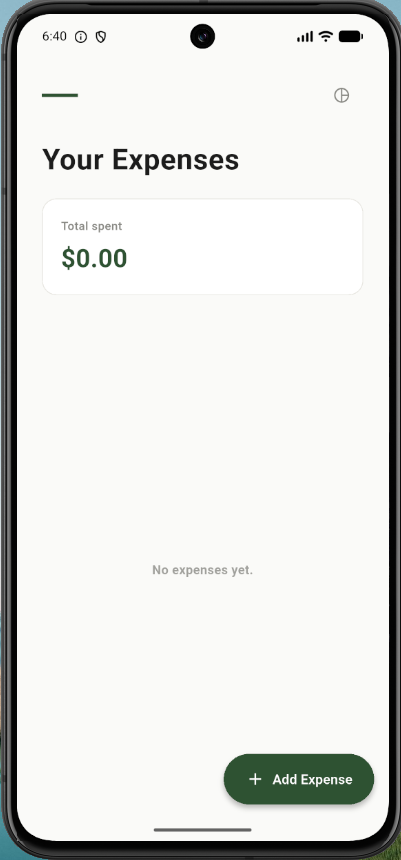
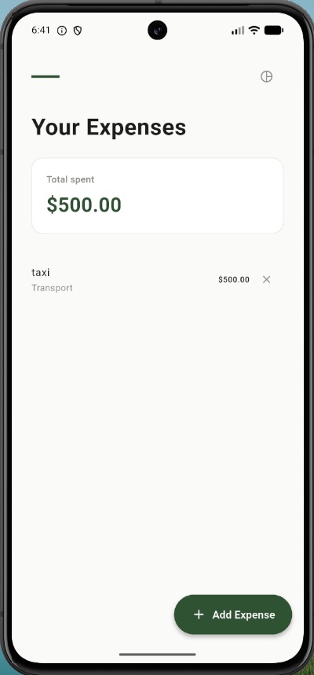
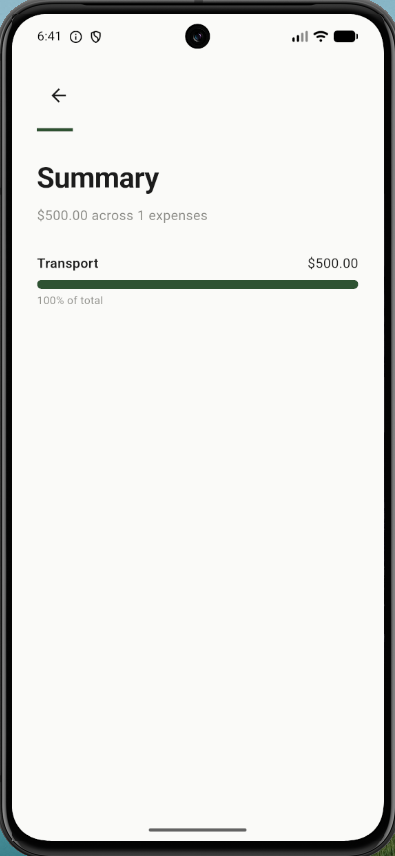

# Expense Tracker 💰

A mobile expense tracking application built with Flutter that helps you log spending, organize it by category, and see where your money actually goes.


## 📱 Screenshots

<!-- Confirm these three filenames match what's actually in your /screenshots folder -->

| Home | Add Expense | Summary |
|:---:|:---:|:---:|
|  |  |  |

## ✨ Features

- Log new expenses and organize them by category
- View your expense history at a glance from the Home screen
- Visual breakdown of spending by category on the Summary screen

## 🛠️ Built With

- [Flutter](https://flutter.dev/) — cross-platform UI framework
- [Dart](https://dart.dev/) — programming language
- `setState` — no external state management package
- No persistent storage yet — expense data lives in memory for the current session

## 🚀 Getting Started

### Prerequisites

- [Flutter SDK](https://docs.flutter.dev/get-started/install) (3.x or later)
- Android Studio or Xcode, for an emulator/simulator
- A physical device or emulator with Flutter set up

### Installation

1. Clone the repository
   ```bash
   git clone https://github.com/ulyawebstudio-web/expense-tracker.git
   ```
2. Move into the project folder
   ```bash
   cd expense-tracker/expense_tracker
   ```
3. Install dependencies
   ```bash
   flutter pub get
   ```
4. Run the app
   ```bash
   flutter run
   ```

## 📂 Project Structure

<!-- Double-check these file names match what's actually in your screens/ folder -->

```
expense_tracker/
└── lib/
    ├── models/
    │   └── expense.dart           # Expense data model
    ├── screens/
    │   ├── home_screen.dart
    │   ├── add_expense_screen.dart
    │   └── summary_screen.dart
    ├── palette.dart                # App colors/theme
    └── main.dart                   # App entry point
```

## 🗺️ Roadmap

- [ ] Add persistent local storage (e.g. Hive or SQLite) so expenses survive app restarts
- [ ] Set and track monthly budgets
- [ ] Cloud backup / sync across devices
- [ ] Export data to CSV or PDF
- [ ] Recurring transactions
- [ ] Multi-currency support

## 🤝 Contributing

Contributions are welcome and appreciated.

1. Fork the project
2. Create your feature branch (`git checkout -b feature/YourFeature`)
3. Commit your changes (`git commit -m "Add YourFeature"`)
4. Push to the branch (`git push origin feature/YourFeature`)
5. Open a Pull Request


## 📧 Contact

[@ulyawebstudio-web](https://github.com/ulyawebstudio-web) on GitHub

Project Link: [https://github.com/ulyawebstudio-web/expense-tracker](https://github.com/ulyawebstudio-web/expense-tracker)
